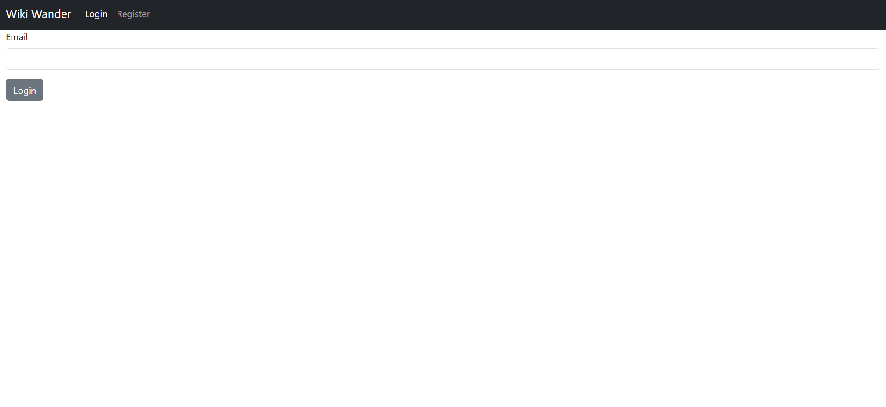
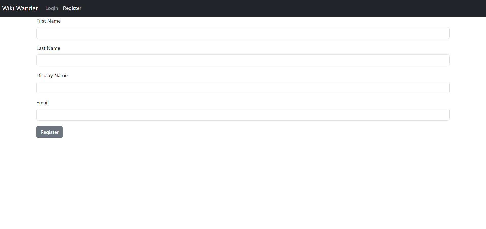
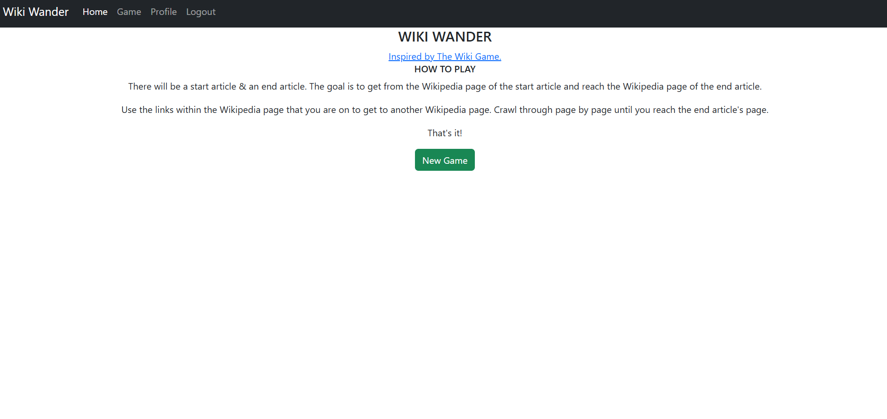
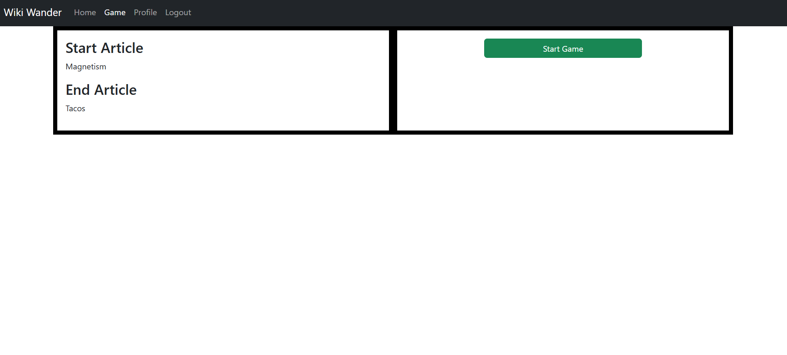
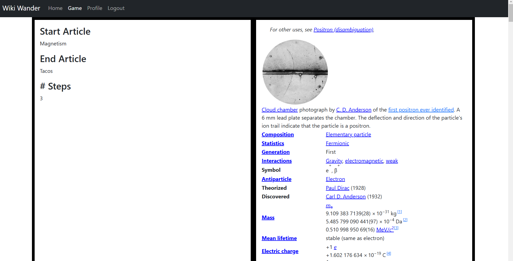
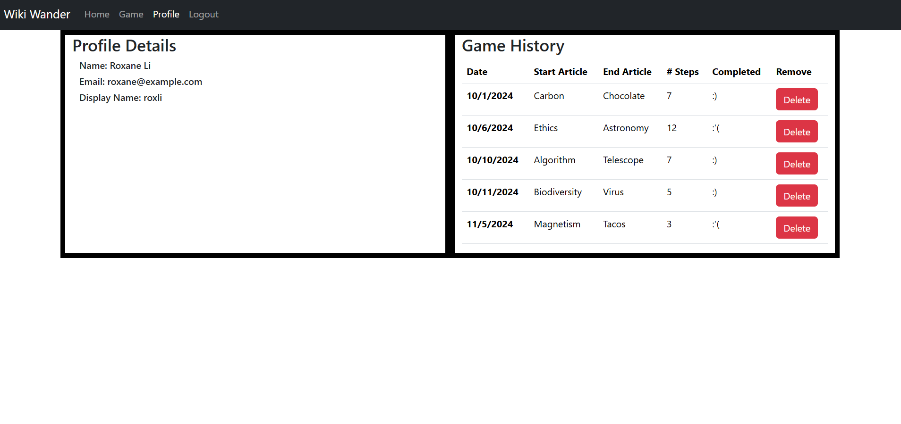

# Wiki Wander

## Walkthrough

### Login

### Register

### Home

### Gameplay - New Game

### Gameplay - Game in Progress

### Profile 

## Install

1. Clone down the repository
2. In the folder with the .sln file, run `start WikiWander.sln`
3. Add `Microsoft.Data.SqlClient` in your Nuget Package Manager in Visual Studio
4. Run the two scripts in the SQL folder to create the database and add the Seed Data
5. Select the green Start button on the toolbar to run the backend
6. In the root folder of the project run `npm install`
7. In root folder, run `npm run dev`

